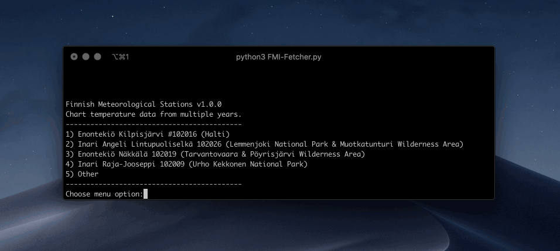
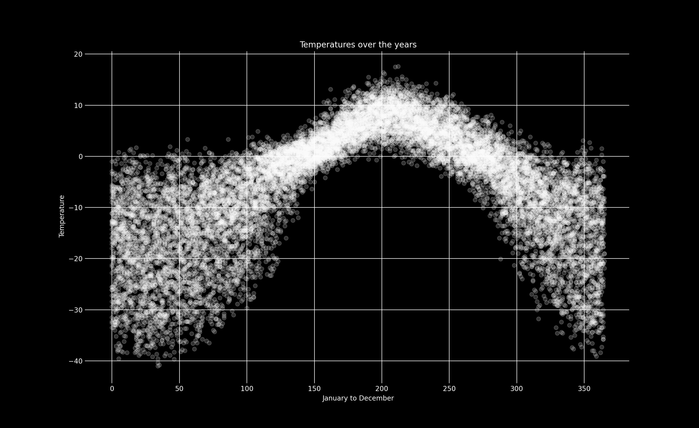
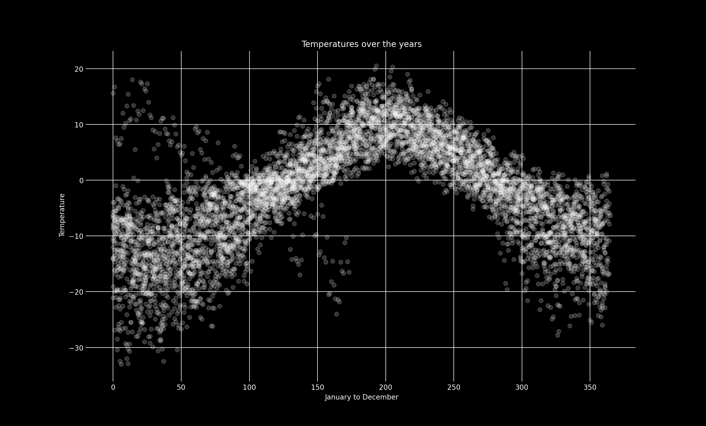

# Temperature Observations
This tool analyses temperatures using data from Finnish Meteorological Stations. I build it to help me with planning expeditions and hikes. Includes some defaults, and supports graphing of multiple years (ranges).




**Examples:**

*1900-2020:* Enontekiö Kilpisjärvi 102016 (Halti Trail, Käsivarren Wilderness Area)



---

*1950-2020:* Inari Raja-Jooseppi 102009 (Urho Kekkonen National Park)



**Requirements:**

Make sure you have Python 3 installed. Then install matplotlib for the charts, and requests for fetching the data from FMI.

```bash
pip install matplotlib
pip install requests
```

**Usage:**
```python
python3 fmi.py
```
This will launch CLI interface, you can choose from predefined options, or a custom option. For custom option you'll need to know ID of the observation station you want to fetch data from.


**Station IDs (fmisid), examples:**
```
102016 - Enontekiö Kilpisjärvi
101920 - Rovaniemi airport 	
102009 - Inari Raja-Jooseppi
```


[Full list of observation station IDs](https://en.ilmatieteenlaitos.fi/observation-stations)

---
*Sources:*

https://en.ilmatieteenlaitos.fi/open-data

https://en.ilmatieteenlaitos.fi/observation-stations

https://en.ilmatieteenlaitos.fi/download-observations
